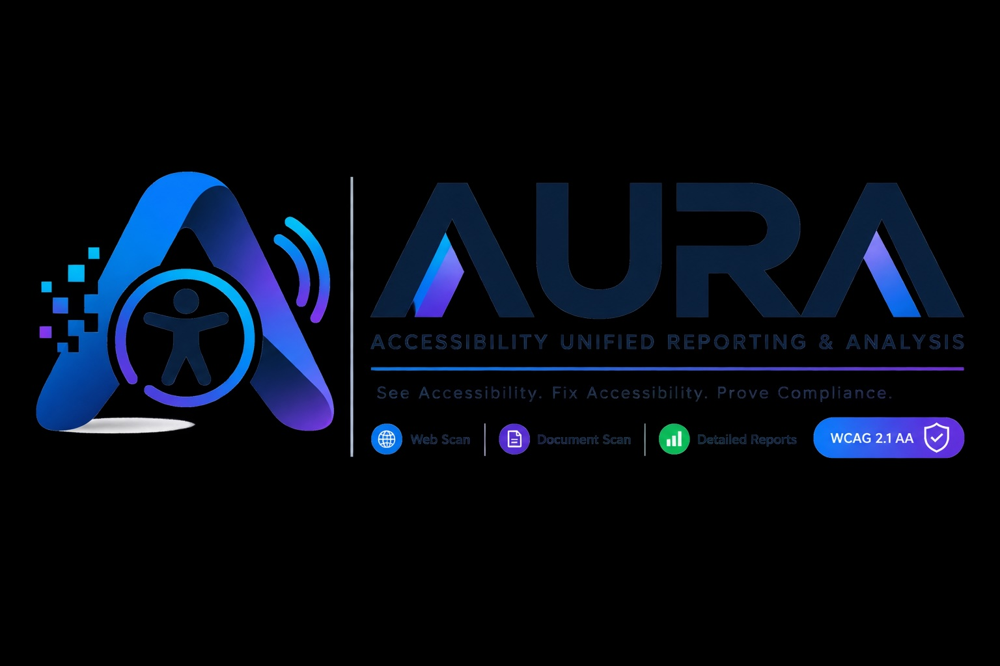

# AURA — Accessibility Unified Reporting & Analysis



AURA is an enterprise-oriented accessibility compliance platform for evidence-backed URL, document, and authenticated workflow scanning. It combines a Signal Ledger-inspired dashboard with persiste[...]

> AURA reports potential accessibility barriers and supports remediation workflows. It does not certify legal compliance or replace a qualified accessibility review.

## Pipeline Metrics

| Metric | Status |
| --- | --- |
| Current Version | v1.0.0 |
| Release Stage | Production Ready |
| Node.js Requirement | 22+ |
| Build Status |  |
| Test Coverage | Full Suite Passing |
| TypeScript Version |  |
| License | MIT |
| Last Updated | 2026-08-17 |

## Current capabilities

| Area | Implementation |
| --- | --- |
| URL scanning | Real URL ingestion with public-target validation, SSRF protections, rate limits, cancellation, persisted findings, and live progress events. |
| Document scanning | Validated document upload and content sniffing for supported text and office-style formats, with persisted document metadata and report linkage. |
| Reporting | Executive score context, severity inventory, WCAG 2.1 AA assessment matrix, ADA-oriented readiness language, manual-review limitations, detailed findings, and source evidence. |
| Exports | Authenticated JSON and Signal Ledger-styled PDF exports built from immutable persisted report detail. |
| Finding workflow | Open, Acknowledged, In Progress, Verified, and Closed states with ownership checks, valid transitions, and audit timestamps. |
| Authenticated crawling | One-time in-memory credentials, explicit manual steps, approved same-origin URLs, bounded sessions, cancellation, and per-step page coverage. |
| Live takeover | Controlled browser-frame streaming and user interaction for MFA checkpoints. Production reliability for long-lived browser sessions remains a Reserved-hosting release gate. |
| Crawl evidence | Sanitized screenshots, selector metadata, and bounded DOM snippets with active-content removal and credential-sensitive redaction. |
| Real-time telemetry | SSE event streams for scan and crawl lifecycle updates, execution-console logs, step history, takeover state, and terminal events. |
| MCP surface | Authenticated API contracts for initialization, tool discovery, scans, status, findings, and reports; configuration guidance is available in the dashboard Settings page. |

## Technology stack

The project uses React 19, Vite 7, Tailwind CSS 4, Express 4, tRPC 11, Drizzle ORM, MySQL/TiDB, Puppeteer Core, PDFKit, SSE, Vitest, and Manus OAuth. The application is organized as a full-stack w[...]

```text
client/                 React application, dashboard layout, scan console, reports, settings
server/                 tRPC routers, database helpers, scan engine, crawl runner, exports
server/_core/           Manus runtime, OAuth, context, storage, and server bootstrap
drizzle/                Database schema and generated migrations
shared/                 Shared constants and types
storage/                Storage integration helpers
```

## Local development

### Prerequisites

Use Node.js 22 or a compatible current Node release, pnpm 10, a MySQL/TiDB database, and a Chromium executable for authenticated crawl sessions. The managed AURA environment supplies the required [...]

### Install dependencies

```bash
pnpm install
```

The repository includes both `pnpm-lock.yaml` and `package-lock.json` for compatibility with the supported package managers. The validated development workflow uses pnpm. If npm reports a dependen[...]

### Configure environment

The application expects the following managed or host-provided values:

| Variable | Purpose |
| --- | --- |
| `DATABASE_URL` | MySQL/TiDB connection string. |
| `JWT_SECRET` | Session-cookie signing secret. |
| `VITE_APP_ID`, `OAUTH_SERVER_URL`, `VITE_OAUTH_PORTAL_URL` | Manus OAuth configuration. |
| `OWNER_OPEN_ID`, `OWNER_NAME` | Owner context used by the managed runtime. |
| `BUILT_IN_FORGE_API_URL`, `BUILT_IN_FORGE_API_KEY` | Server-side Manus API access, including storage and platform services. |
| `VITE_FRONTEND_FORGE_API_URL`, `VITE_FRONTEND_FORGE_API_KEY` | Frontend-compatible Manus API access where required. |
| `CHROMIUM_PATH` | Optional path to Chromium for the authenticated crawler; defaults to `/usr/bin/chromium`. |

### Database schema

Generate and apply Drizzle migrations with:

```bash
pnpm db:push
```

Review generated migration SQL before applying it to a production database. The application persists scan jobs, findings, report snapshots, documents, crawl plans, crawl sessions, crawl page cover[...]

### Run the application

```bash
pnpm dev
```

The development server starts the full-stack runtime and Vite through `server/_core/index.ts`. The port is assigned by the managed runtime; do not hardcode a deployment port in application code.

## Scan workflows

The Scan page starts with the `01 / TARGET` section. Users can submit a normalized public URL, choose an uploaded document, or switch to Website crawl for an authenticated workflow. After submissi[...]

For authenticated crawling, define explicit steps and an approved URL allowlist. Credentials are accepted for one session, retained in memory only, cleared after the crawl lifecycle ends, and exc[...]

```json
[
  { "type": "open", "url": "https://example.com/login" },
  { "type": "fill", "selector": "input[name=email]", "credential": "username" },
  { "type": "fill", "selector": "input[type=password]", "credential": "password" },
  { "type": "click", "selector": "button[type=submit]" },
  { "type": "mfa_checkpoint", "label": "Complete MFA if prompted" },
  { "type": "open", "url": "https://example.com/account" },
  { "type": "scan_page" }
]
```

Authenticated crawl restrictions include same-origin navigation, explicit approved URLs, DNS and private-network protection, bounded sessions, no CAPTCHA bypass, cooperative cancellation, and con[...]

## Evidence handling

Each manual crawl step can persist a screenshot reference, selector metadata, and a DOM snippet. DOM capture removes script, style, iframe, object, embed, and related active-content blocks; redac[...]

Evidence is rendered through expandable history cards in the Scan execution console. The UI labels screenshots as sanitized, presents selector metadata in a readable monospace block, and exposes [...]

## Reports and exports

The Report page reads persisted report detail and findings. It includes executive summary context, score and severity information, source metadata, detailed issue rows, WCAG principle and criteri[...]

Report language intentionally avoids legal-certification claims. Automated results should be supplemented with manual keyboard, screen-reader, cognitive, content, and interaction review.

## Test, typecheck, and build commands

```bash
pnpm check
pnpm test
pnpm build
```

The validated AURA source currently passes TypeScript checking, the full Vitest suite, and the production client/server build. Tests cover authentication boundaries, URL and document validation, [...]

## Production and hosting notes

AURA is currently configured for managed Autoscale hosting. Ordinary URL and document scans fit the current model. Reliable live browser takeover and long-running authenticated Chromium sessions [...]

Before publishing, create a project checkpoint in the management interface and use the Publish action. Production secrets must be configured through the project's secret-management workflow. Neve[...]

## MCP and IDE integration

The dashboard Settings page contains the current AURA MCP integration guidance for Cursor, Claude Code, Kiro, and compatible clients. The public beta documents the authenticated MCP contract and avail[...]

## License

This project is distributed under the MIT license declared in `package.json`. Review dependency licenses and deployment obligations before commercial distribution.
